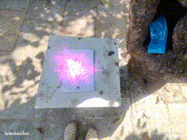
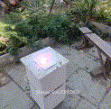
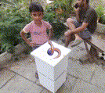

# Spectacles Vision Crafter 🪄✨  
Turn your sketches into stunning 3D magic — inspired by Shakalaka Boom Boom.

## 📸 What is Vision Crafter?

**Vision Crafter** is an innovative & experimental SnapAR experience that lets you point your **Snapchat Spectacles** at a sketch or doodle, and watch it come alive as a 3D model — just like the magical pencil from *Shakalaka Boom Boom*.

It uses a combination of voice control, camera input, AI vision, and 3D generation to convert **drawings into 3D assets** in real-time.

---

## 🎬 Demo Preview

| Drawing Input | Vision Processing | 3D Processing | Final Output | Example Output |
|---------------|------------------|--------------------|----------------|----------------|
|  |  |  |  |  |

---

## ⚙️ Key Features

- **🎨 Drawing-first AI understanding**  
  Detects and prioritizes sketches and doodles as the main object, ignoring canvases like paper, iPad, notebooks, walls, or drawing tool through prompt guidance 

- **🗣️ Voice-activated scanning**  
  Users can trigger the entire vision scan process through **speech recognition** via the Voice ML module.

- **📷 Spectacles Camera access**  
  Camera frame capture powered by **Camera Module**

- **⚓ Object anchoring**  
  **Instant World Hit Test** for immediate 3D anchoring to wherever you're looking at

- **🧠 Smart prompt generation using Vision**  
  Frame data is processed using **OpenAI Vision API** to generate a **precise, 3D-ready text prompt for asset generation**.

- **🌐 3D asset creation using Meshy**  
  Uses **Meshy API** to convert the text prompt into a textured 3D model, streamed back instantly.

- **🧊 Remote 3D asset injection**  
  Final 3D model is **injected into the scene** using **Remote Media Module**.

- **✨ Edge-fade overlay trick**  
  A visual UX trick to **fade out edges** and avoid harsh cutoff overlays for a seamless AR experience.
---

## 🧪 Technical Stack

| Feature              | Technology Used                                                                 |
|----------------------|----------------------------------------------------------------------------------|
| Voice Trigger         | [Voice ML Module](https://developers.snap.com/lens-studio/features/voice-ml/speech-recognition) |
| Frame Capture         | [Camera Module](https://developers.snap.com/spectacles/about-spectacles-features/apis/camera-module)  |
| Internet API Calls    | [Remote Service Module (Fetch)](https://developers.snap.com/spectacles/about-spectacles-features/apis/internet-access) |
| Frame Analysis        | [OpenAI GPT-4 Vision API](https://platform.openai.com/docs/guides/images?api-mode=responses)      |
| 3D Model Generation   | [Meshy API](https://docs.meshy.ai/api/text-to-3d)                                               |
| Model Injection       | [Remote Media Module](https://developers.snap.com/lens-studio/api/lens-scripting/classes/Built-In.RemoteMediaModule.html#loadresourceasgltfasset) |
| Anchoring             | [Instant World Hit Test](https://developers.snap.com/lens-studio/features/ar-tracking/world/world-templates/instant-world-hit-test) |
| Platform              | [Lens Studio](https://ar.snap.com/) + [Spectacles](https://www.spectacles.com/?lang=en-US) |

---

## 🧒 Inspired By

Inspired by the Indian TV show **Shakalaka Boom Boom**, where anything you drew with a magic pencil came to life. Vision Crafter brings that fantasy to life using today's cutting-edge tech.

---

## 🧰 How to Use

1. **Configure API Keys**  
   Navigate to the `APIConfig` script inside the `LensControllers` SceneObject and replace the placeholder values with your **OpenAI Vision** and **Meshy API** keys.

2. **Enable Scene Understanding**  
   The experience begins by capturing a frame through Spectacles using **Camera Module**, which is then sent to **OpenAI GPT-4 Vision** for intelligent interpretation and generation of a 3D-friendly text prompt.

3. **Generate 3D Assets**  
   The generated prompt is passed to the **Meshy API**, which returns a corresponding 3D model. This model is streamed and loaded using the **Remote Media Module**.

4. **Apply Material (Optional)**  
   Since the Meshy API is currently used in preview mode without texture generation, a **placeholder material** is automatically applied to the imported model.

5. **Anchor the Model in the Real World**  
   The asset is positioned using **Instant World Hit Test**, allowing immediate placement at the center of the user’s field of view.

6. **Initiate Scan via Voice Command**  
   The scanning process is triggered using speech recognition. The default keyword is **“boom”**, and both the trigger phrase and hint can be customized within the `VoiceCommandHandler` script.

7. **Enhance Visual UX**  
   A custom **edge-fade masking** technique is used to soften the periphery and avoid sharp cutoffs in the AR display, ensuring a smoother, more immersive experience.

---

## 📜 License

This project is licensed under the **MIT License**  
© 2025 **Krunal MB Gediya**

---

## 🤝 Contributions

Open to improvements, issues, and community collabs. Feel free to fork, play, and create some krazyy AR with us.

---
